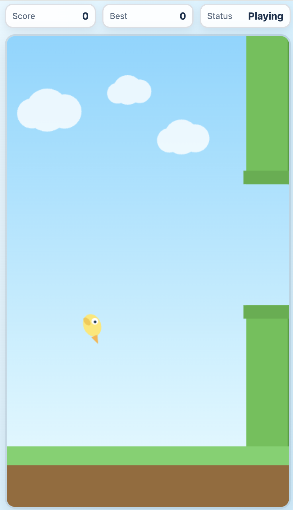
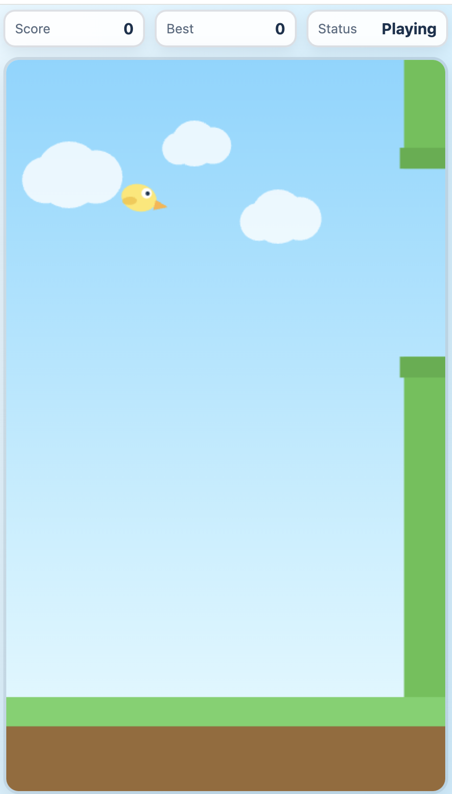

# Flappy Bird (Instructional Build Log)

This README is for teaching younger beginners how to prompt an AI to build a game in small steps. It shows the exact prompt flow, how requirements were captured, and how we iterated on visuals after the first version.

Built with GPT-5.3-Codex.

## What we built

A browser Flappy Bird game using only:

- `index.html`
- `style.css`
- `script.js`

Features included:

- Space + mouse click controls
- Start screen + instructions
- Game over screen + restart options
- Pause with `P`
- Sound effects
- Score + high score saved in browser (`localStorage`)
- Bright cartoon style

---

## Full prompt and question flow

### 1) Initial user prompt

> I want to make a Flappy Bird game. In the browser. I don't know anything about making games. I do want it just to work with just HTML and JavaScript. And be in the flappy birds folder. But if you would ask me questions about design choices, I'll answer them and then like you did to get started on making the game.

### 2) AI clarifying questions and user answers

**Q: Game Feel**
- Easy
- Normal
- Hard

**User answer:** Normal

**Q: Controls**
- Space key
- Mouse click
- Touch tap
- All of the above

**User answer:** Space key + Mouse click

**Q: Visuals**
- Simple clean shapes
- Pixel-style look
- Bright cartoon look

**User answer:** Bright cartoon look

**Q: Extras**
- Start screen with instructions
- Game over screen + restart
- High score saved in browser
- Sound effects
- Pause key (`P`)

**User answer:** Chose all listed extras

### 3) Implementation pass

AI generated and wired up:

- `games/flappy-bird/index.html` for HUD/canvas/overlays
- `games/flappy-bird/style.css` for bright cartoon UI
- `games/flappy-bird/script.js` for game loop, physics, pipes, collision, scoring, pause, sound, and high score
- `games/flappy-bird/README.md` starter docs

### 4) Iteration prompt (visual fix)

User follow-up prompt:

> Okay now lets fix the birds eye. right now it's at the back of the head instead of the front of the head

AI applied a surgical update in `drawBird()`:

- Eye moved from `(-4, -6)` to `(6, -6)`
- Pupil moved from `(-3, -6)` to `(7, -6)`

This changed the bird from “looking backward” to “looking forward” toward the beak.

---

## Eye iteration: before vs after

### Before (eye too far back)



### After (eye moved to front)



---

## Why this teaching format works for kids and beginners

1. Start with plain language goals, not code.
2. Let AI ask focused design questions.
3. Answer with preferences (difficulty, style, controls).
4. Generate a first playable version quickly.
5. Play-test and give one clear fix request at a time.
6. Repeat until the game feels right.

The big lesson: you can build a working game by making good decisions step-by-step, even if you are new.

---

## Run the game

Open `index.html` in a modern browser.

From terminal:

```bash
cd games/flappy-bird
open index.html
```

## Controls

- `Space`: flap
- Mouse click on the canvas: flap
- `P`: pause/resume
